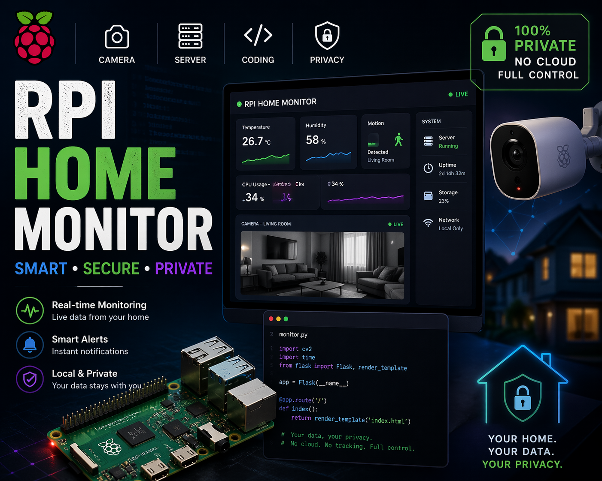

# RPi Home Monitor

<p align="center">
  
</p>

[](https://github.com/vinu-dev/rpi-home-monitor/actions/workflows/test.yml)

> **Disclaimer:** This is a personal, hobbyist project provided **as-is** under the [AGPL-3.0 license](LICENSE). It has **not been professionally tested or audited**, may contain bugs, and **may have unresolved security vulnerabilities**. Do not rely on it to protect critical assets. No warranty is given — use at your own risk.

**A self-hosted home security camera system built on Raspberry Pi.** Open-source alternative to Ring, Tapo, and Nest — with no cloud subscriptions, no vendor lock-in, and complete control over your data.

RPi Home Monitor runs **Home Monitor OS**, a custom Linux distribution built with the Yocto Project, purpose-built for home surveillance on low-cost hardware.

## Why RPi Home Monitor?

- **Your data stays home.** Video never leaves your network. No cloud uploads, no third-party access, no monthly fees.
- **Security by design.** HTTPS for web, mTLS camera streaming, encrypted storage (LUKS), firewall-hardened OS, bcrypt auth with TOTP 2FA and rate limiting, PIN-based camera pairing.
- **Built on real hardware.** Runs on a $35 Raspberry Pi 4B (server) and $15 Zero 2W (cameras). No proprietary hardware required.
- **Automatic camera discovery.** Plug in a camera node, connect it to WiFi, and it appears in your dashboard via mDNS.
- **OTA with rollback, validated end-to-end.** A/B SWUpdate with bootlimit rollback, signed bundles, dual-transport (admin GUI and server-pushed), and a camera-side privilege-separated installer. All three install paths have been exercised on real Pi 4B + Pi Zero 2W hardware.
- **Tapo-style recording.** Continuous 3-minute MP4 clips organized by camera and date, with timeline playback.
- **On-camera motion detection.** Two-frame differencing + hysteresis runs at 5 fps on the camera's ISP lores stream, posts HMAC-signed events to the server, and clicking an event on the dashboard seeks straight into the recording at that timestamp. Three recording modes — off / continuous / schedule / motion-only — share the same event feed (ADR-0021).
- **Fully open source.** Inspect every line, from the OS image to the web dashboard. AGPL-3.0 licensed.

## Architecture

```
┌─────────────────┐    RTSP stream      ┌──────────────────┐    HTTPS     ┌──────────┐
│  Camera Node    │ ─────────────────> │   Home Server     │ <────────── │  Phone / │
│  RPi Zero 2W   │                     │   RPi 4 Model B   │             │  Laptop  │
│                 │    mDNS discovery   │                    │             │          │
│  1080p capture  │ <─ ─ ─ ─ ─ ─ ─ ─> │  Records clips     │             │  Web UI  │
│  RTSP stream    │                     │  Serves dashboard  │             │  Live    │
│  Auto-pairs     │    OTA push         │  Manages cameras   │             │  Playback│
│                 │ <───────────────── │  System health     │             │  Admin   │
└─────────────────┘                     └──────────────────┘             └──────────┘
       x N                                     x 1                           x N
```

| Component | Hardware | Role |
|-----------|----------|------|
| **Home Server** | Raspberry Pi 4 Model B (4GB+) | Receives streams, records clips, serves web dashboard, manages cameras |
| **Camera Node** | Raspberry Pi Zero 2W + ZeroCam | Captures 1080p video, streams to server over RTSPS |
| **Dashboard** | Any phone/laptop on LAN | Live view (WebRTC/HLS), clip playback, camera management, system admin |

## First Boot Setup

Both the server and camera use a **captive portal** for zero-config WiFi provisioning. Both devices share the same product **LED status feedback** policy. Full step-by-step instructions are in [CHANGELOG.md](CHANGELOG.md#setup-guide).

**Quick version:**
1. **Power on** — the device LED blinks while booting, then slow-blinks in setup mode
2. **Connect phone** to hotspot (`HomeMonitor-Setup` / `HomeCam-Setup`) using the factory setup password (`homemonitor` for server, `homecamera` for camera). The setup wizard then requires a new setup hotspot password for future setup/reset mode.
3. **Server certificate login** — on certificate-auth builds, install a Home Monitor Provisioning CA-signed `.p12` on the laptop or phone before opening the server GUI.
4. **Setup wizard auto-opens** — configure WiFi + server setup actions using the certificate-authenticated browser session, or configure WiFi + server address + camera login for cameras.
5. **Done** — LED goes solid = running. Camera finds server automatically via `rpi-divinu.local`
6. **Access camera** at `https://rpi-divinu-cam-XXXX.local` (shown after setup completes)

### Certificate-Only Server Login

The `docs/local-ca-mtls-design` branch packages server GUI login in certificate
mode. There is no shared default GUI password for this flow.

The certificate authority tooling lives outside this repository in the private
`home-monitor-ca-generator` project. Use it to create the Home Monitor
Provisioning CA, issue laptop/mobile `.p12` client certificates, and export
only the public CA certificate into this repository before building:

```powershell
python .\home_monitor_ca.py export-public-ca --dest D:\Codex\rpi-home-monitor\local-secrets\provisioning-ca\home-monitor-provisioning-ca.crt
```

`local-secrets/` and the generated Yocto copy are gitignored. The RPI image
packages only the public trust anchor at
`/etc/home-monitor/trust/home-monitor-provisioning-ca.crt`; private CA keys,
client keys, `.p12` bundles, and passphrases stay in the private CA generator
project.

The detailed workflow and diagrams are in
[docs/exec-plans/local-ca-client-certificate-auth.md](docs/exec-plans/local-ca-client-certificate-auth.md).

### LED Status Indicators

| LED Pattern | Meaning |
|-------------|---------|
| **Boot blink** (500ms on / 500ms off) | Booting or validating a newly installed slot |
| **Paired blink** (400ms on / 1200ms off) | Camera pairing or trust handoff is active |
| **Long-on blink** (1800ms on / 200ms off) | OTA image is being written |
| **Very fast blink** (150ms or 100ms cadence) | OTA reboot, reset, or urgent recovery action |
| **Error blink** (100ms on / 900ms off) | Error: connection failed or recovery path active |
| **Slow blink** (1s on / 1s off) | Setup mode — waiting for WiFi configuration |
| **Fast blink** (200ms on / 200ms off) | Connecting — attempting to join WiFi network |
| **Solid on** | Running normally — connected and operational |
| **Off** | Service stopped |

### Server Discovery (mDNS)

The server advertises itself as `rpi-divinu.local` on the local network via Avahi/mDNS. Cameras find the server automatically — no need to know the server's IP address. Each camera also gets its own `.local` address (e.g., `https://rpi-divinu-cam-d8ee.local`) for direct access to its status page. If mDNS doesn't work on your network, enter IPs manually.

## Key Features

| Feature | Details |
|---------|---------|
| Live View | WebRTC (sub-second latency) with HLS fallback in any mobile browser |
| Recording | Continuous 3-minute MP4 clips, organized by camera/date. Four modes: off / continuous / schedule / motion-only |
| Motion Detection | On-camera two-frame differencing at 5 fps on the Picamera2 lores stream. HMAC-signed events posted to the server, listed on the dashboard with wall-clock time, and click-through seeks into the recording at the motion timestamp. Motion-only recording mode records just the event windows + 10 s post-roll. See ADR-0021 |
| Camera Management | Auto-discovery, confirm/rename/remove via dashboard |
| User Auth | Server: bcrypt + CSRF + TOTP 2FA + rate limiting + active-session inventory/revoke controls. Camera: PBKDF2-SHA256 + sessions. **Note:** a default `admin`/`admin` account is created on first boot — change the password during setup |
| Role-Based Access | Admin (full control) and Viewer (read-only) roles |
| System Health | CPU temp, memory, disk usage, uptime monitoring |
| Storage Management | Automatic cleanup of oldest clips when disk is full |
| OTA Updates | End-to-end validated on real hardware — server GUI upload+install, server→camera push, and camera-direct GUI upload. Camera installs automatically reboot themselves, the server confirms the reported target version after boot, and A/B rollback with bootlimit protects failed slots |
| Audit Logging | All admin actions logged (append-only) |
| Encrypted Storage | LUKS-encrypted /data partition for recordings and config |
| Firewall | nftables — cameras can only talk to server, minimal open ports |

### Security Feature Status

| Feature | Status | Notes |
|---------|--------|-------|
| HTTPS (TLS) | **Implemented** | Self-signed certs, NGINX terminates TLS |
| bcrypt auth + CSRF | **Implemented** | Cost 12, rate limiting (warn at 5, block at 10) |
| TOTP two-factor auth | **Implemented** | Account enrollment, recovery codes, admin reset, optional remote-access enforcement |
| Session management | **Implemented** | 30min idle / 24hr absolute timeout; Settings Security shows active devices and supports current, per-session, and bulk revoke |
| LUKS encryption | **Partial** | Design and implementation work exist, but production-grade validation is still in progress |
| nftables firewall | **Implemented** | Default DROP, minimal open ports |
| Audit logging | **Implemented** | Append-only JSON, all admin actions; admin CSV/JSON export from `/logs` |
| Default admin warning | **Implemented** | `admin`/`admin` created on first boot, must change during setup |
| RTSPS (mTLS) | **Implemented** | Camera streams over RTSPS with mTLS client certs after pairing |
| mTLS camera pairing | **Implemented** | PIN-based pairing with certificate exchange (ADR-0009) |
| Local GUI client certificate login | **Branch** | `docs/local-ca-mtls-design` supports certificate-only server GUI login using a locally generated Home Monitor Provisioning CA and browser-installed `.p12` client certificates |
| Factory reset | **Implemented** | WiFi wipe, config reset, returns to first-boot state |
| OTA updates | **Implemented** | Three GUI-driven install paths validated on hardware; CMS signature verification in production builds (ADR-0014); A/B rollback with bootlimit; camera installer runs privilege-separated via systemd `.path` trigger and owns reboot/activation (ADR-0020). See `docs/history/planning/update-roadmap.md` |

## Quick Start

```bash
# Clone
git clone git@github.com:vinu-dev/rpi-home-monitor.git ~/yocto
cd ~/yocto

# Install prerequisites (Ubuntu 24.04)
./scripts/setup-env.sh

# Build images
./scripts/build.sh server-dev      # RPi 4B development image
./scripts/build.sh camera-dev      # Zero 2W development image

# Certificate-auth server builds require the public CA certificate to be
# exported first, then staged for Yocto.
bash scripts/stage-provisioning-ca.sh
./scripts/build.sh server-dev

# Flash to SD card
bzcat build/tmp/deploy/images/raspberrypi4-64/home-monitor-image-dev-*.wic.bz2 \
  | sudo dd of=/dev/sdX bs=4M status=progress
```

First build takes 2-4 hours. Subsequent builds use cached artifacts and are much faster.

## Build Targets

| Command | Board | Image |
|---------|-------|-------|
| `./scripts/build.sh server-dev` | RPi 4B | Development (debug, root SSH) |
| `./scripts/build.sh server-prod` | RPi 4B | Production (hardened, no root) |
| `./scripts/build.sh camera-dev` | Zero 2W | Development (debug, root SSH) |
| `./scripts/build.sh camera-prod` | Zero 2W | Production (hardened, no root) |

## Run Tests

```bash
cd app/server && pytest tests/unit tests/integration tests/contracts
cd app/camera && pytest tests/unit tests/integration tests/contracts
npx playwright test --project=smoke
```

Results and coverage reports are available in the [CI workflow](https://github.com/vinu-dev/rpi-home-monitor/actions).

## Documentation

| Document | What's Inside |
|----------|---------------|
| [Documentation Map](docs/README.md) | Human and AI entrypoint for current docs |
| [Hardware Setup](docs/guides/hardware-setup.md) | Shopping list, assembly, flashing, first boot, troubleshooting |
| [Build Setup](docs/guides/build-setup.md) | Build machine requirements, prerequisites, build commands |
| [Requirements](docs/history/baseline/requirements.md) | Historical product requirements baseline |
| [Architecture](docs/history/baseline/architecture.md) | Historical system design, security model, threat analysis, data model |
| [Development Guide](docs/guides/development-guide.md) | Git workflow, Yocto rules, app conventions, security rules |
| [Testing Guide](docs/guides/testing-guide.md) | Writing tests, running tests, coverage targets |

## Roadmap

- **Phase 1** (shipped): Single camera, live view, clip recording, web dashboard, authentication, security hardening, mTLS camera pairing, OTA updates, factory reset
- **Phase 2** (current): Multi-camera support, **motion detection** (ADR-0021, shipped), **motion-only recording mode**, dashboard events feed. Remaining: per-camera sensitivity slider, motion zones (draw-on-snapshot), push notifications, audio
- **Phase 3**: Cloud relay, mobile app, AI/ML object detection (MOG2 on server or Pi 5 hardware refresh), activity zones, clip protection, smart home integration

## Contributing

Contributions are welcome. Please read the [Development Guide](docs/guides/development-guide.md) before submitting a PR.

## License

This project is licensed under **AGPL-3.0** — see [LICENSE](LICENSE) for details.
