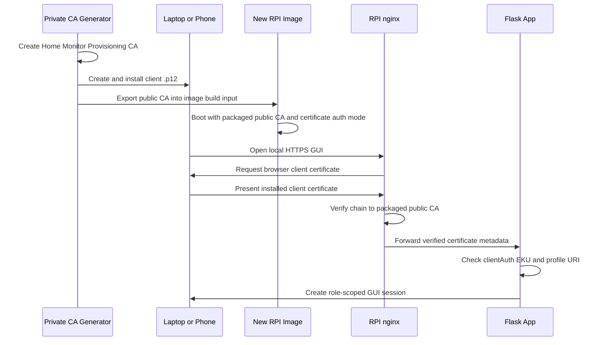

# Local CA Client-Certificate Auth Implementation

## Goal

Implement the first safe vertical slice of local/offline-CA client certificate
authentication for the server GUI, then package the server image so local GUI
login is certificate-only by default.

## Non-Goals

- Do not merge to `main`.
- Do not add the CA generator project to this RPI repository.
- Do not commit CA private keys, client private keys, laptop/mobile `.p12`
  bundles, passphrases, or generated RPI private keys to this RPI repository.
- Do not remove the underlying password/session implementation in this branch;
  it remains available for future explicit recovery/admin modes, but packaged
  server GUI login is configured for certificate mode.

## Constraints

- Security-sensitive change: certificate-only login is now the packaged server
  default for this branch, so the image build must fail early if the local
  public CA trust anchor is missing.
- Preserve ADR-0022: certificate auth must be a primary auth mechanism for the
  configured mode, not a hidden recovery bypass.
- Trust certificate headers only from nginx-to-Flask localhost deployment.
- Keep routes thin and put certificate validation in a service.
- Maintain traceability annotations and focused security tests.
- Existing unrelated dirty files in the worktree must not be staged.
- The CA generator is a separate private project:
  `https://github.com/vinu-dev/home-monitor-ca-generator`.

## Context

- Branch: `docs/local-ca-mtls-design`
- Design spec: `docs/history/specs/local-ca-client-certificate-auth.md`
- Server nginx TLS config: `app/server/config/nginx-monitor.conf`
- Server auth/session code: `app/server/monitor/auth.py`
- Server view routing: `app/server/monitor/views.py`
- Existing camera mTLS precedent: `app/camera/camera_streamer/control_server.py`
- Private CA generator repo:
  `D:\Codex\home-monitor-ca-generator` /
  `https://github.com/vinu-dev/home-monitor-ca-generator`
- RPI build input for public trust anchor:
  `local-secrets/provisioning-ca/home-monitor-provisioning-ca.crt`
- Packaged RPI trust anchor path:
  `/etc/home-monitor/trust/home-monitor-provisioning-ca.crt`

## Plan

1. Add auth mode configuration:
   - `AUTH_MODE=password|certificate|mixed`
   - service package default `certificate`
2. Add certificate auth service:
   - read nginx client certificate headers
   - require nginx verification success
   - parse PEM cert when present
   - enforce `clientAuth` EKU
   - map certificate profile to effective role
   - support local denylist/allowlist shape
3. Add cert-backed session entry point:
   - `POST /api/v1/auth/cert/session`
   - `GET /api/v1/auth/cert/me`
   - no password fallback in `certificate` mode
4. Wire view auto-login for certificate mode if safe and testable.
5. Add nginx client-cert request headers in a way that does not require client
   certs by default.
6. Add focused unit/security tests.
7. Add build-time public CA staging from `local-secrets/`.
8. Package the public CA certificate and nginx client-cert snippet into the
   server image.
9. Keep the CA generator separate in the private
   `home-monitor-ca-generator` repository.
10. Run relevant validation and push the design branch.

## CA Generator Project

The CA generator is intentionally outside this RPI repository. It is a
separate private GitHub project:

```text
https://github.com/vinu-dev/home-monitor-ca-generator
```

Current local path:

```text
D:\Codex\home-monitor-ca-generator
```

It contains:

- `home_monitor_ca.py` command-line tool
- `python home_monitor_ca.py wizard` menu-driven flow
- `init-ca` to create the Home Monitor Provisioning CA
- `issue-client` to create laptop/mobile browser-login `.p12` bundles
- `issue-rpi` to create optional per-RPI HTTPS/server certificates
- `export-public-ca` to copy only the public CA certificate into the RPI build
  input folder

Generated private CA material, generated client certificates, generated `.p12`
bundles, and passphrase files are committed in that private CA-generator repo
per operator direction. They are not committed in this RPI repository.

## Build-Time CA Flow

1. Operator runs the private CA generator.
2. Operator creates or reuses the Home Monitor Provisioning CA.
3. Operator creates laptop/mobile certificates with a profile such as
   `owner-admin`:

   ```powershell
   python .\home_monitor_ca.py issue-client --name "vinu-laptop" --profile owner-admin
   ```

4. Operator installs the generated `.p12` on the service laptop or phone.
5. Operator exports only the public CA certificate into this RPI repo's
   gitignored input folder:

   ```powershell
   python .\home_monitor_ca.py export-public-ca --dest D:\Codex\rpi-home-monitor\local-secrets\provisioning-ca\home-monitor-provisioning-ca.crt
   ```

6. `scripts/build.sh` calls `scripts/stage-provisioning-ca.sh` for
   `home-monitor-image-*` builds.
7. The staging script refuses to continue if the public CA certificate is
   missing, and copies it to:

   ```text
   app/server/config/generated/trust/home-monitor-provisioning-ca.crt
   ```

8. The Yocto recipe packages that staged public CA certificate into:

   ```text
   /etc/home-monitor/trust/home-monitor-provisioning-ca.crt
   ```

9. The Yocto recipe also packages:

   ```text
   /etc/nginx/client-cert.d/provisioning-client-ca.conf
   ```

10. nginx includes only packaged client-cert snippets from `/etc`. It does not
    include `/data/config/nginx-client-cert.d/*.conf`, because stale test
    snippets from older deployments can duplicate `ssl_client_certificate` and
    make nginx fail on OTA boot.
11. nginx requests client certificates, verifies that the presented browser
    certificate chains to the packaged public CA, and passes verified
    certificate headers to Flask.
12. Flask certificate auth validates the certificate profile and creates the
    logged-in session without username/password entry.

## Laptop/Mobile Login Flow



## Resumption

- Current status: certificate auth core is implemented; RPI service package is
  being updated to default to certificate-only GUI login and consume a
  build-time public CA trust anchor.
- Last completed step: private CA-generator repo created and pushed; public CA
  exported into this repo's gitignored local build input folder.
- Next step: validate packaging guards, review branch diff, and push branch
  update.
- Branch / PR: `docs/local-ca-mtls-design`, no PR merged.
- Devices / environments: local repo first; VM only if build/image validation is
  needed later.
- Commands to resume:
  - `git switch docs/local-ca-mtls-design`
  - inspect dirty files with `git status --short`
  - continue from this exec plan
- Open risks / blockers:
  - existing unrelated dirty files must remain unstaged
  - full no-password first-boot flow is intentionally deferred until core auth
    is reviewed
  - current branch default disables GUI password login for the packaged server
    service; recovery/admin policy still needs final operator approval before
    merge
  - `openapi/server.yaml` was already dirty before this task; avoid mixing API
    contract edits into this branch update unless a clean patch can be staged
    separately

## Validation

Completed local validation:

```bash
pytest app/server/tests/unit/test_certificate_auth_service.py app/server/tests/security/test_certificate_auth.py -v
pytest app/server/tests/security/ -v
pytest app/server/tests/unit/test_init.py app/server/tests/unit/test_app.py -v
python tools/docs/check_doc_map.py
python scripts/ai/check_doc_links.py
python scripts/ai/validate_repo_ai_setup.py
python tools/traceability/check_traceability.py
ruff check app/server/monitor app/server/tests/unit/test_certificate_auth_service.py app/server/tests/security/test_certificate_auth.py
ruff format --check app/server/monitor app/server/tests/unit/test_certificate_auth_service.py app/server/tests/security/test_certificate_auth.py
ruff check .
ruff format --check .
python scripts/check_version_consistency.py
python scripts/check_versioning_design.py
```

Results:

- Focused certificate-auth tests: 15 passed.
- Server security suite: 114 passed.
- Startup/app factory tests: 47 passed.
- Repo-wide ruff check/format, docs, traceability, and versioning guards passed.
- VM image build validation was not run for this opt-in app/config slice.

Hardware/dev-RPI validation on 2026-06-03:

- Branch commit deployed to server `192.168.1.245` from a clean `git archive
  HEAD` snapshot to avoid unrelated local dirty files.
- Temporary test CA/client material was generated locally for the hardware
  smoke test; no private keys or certificates were committed in this RPI repo.
- Installed test trusted client CA at `/data/config/provisioning-ca.crt`.
- Earlier hardware testing enabled nginx client certificate verification with
  `/data/config/nginx-client-cert.d/provisioning-client-ca.conf`.
  The packaged image no longer includes `/data/config/nginx-client-cert.d/*.conf`
  to avoid stale duplicate `ssl_client_certificate` directives after OTA.
- Enabled monitor mixed mode through
  `/etc/systemd/system/monitor.service.d/20-cert-auth.conf`:
  `MONITOR_AUTH_MODE=mixed`,
  `MONITOR_CERT_AUTH_ALLOW_PROFILE_LOGIN=1`,
  `MONITOR_CERT_AUTH_ENFORCE_TIME=1`.
- Positive cert API test:
  `POST https://192.168.1.245/api/v1/auth/cert/session` with the signed client
  cert returned HTTP 200, `auth_method=client_certificate`, profile
  `owner-admin`, role `admin`, username `vinu-service-laptop`.
- Negative cert API test without a client cert returned HTTP 401 with
  `client certificate was not verified`.
- Temporary certificate-only mode check passed:
  password login returned HTTP 404 `Password login is disabled`; cert login
  still returned HTTP 200.
- Server was restored to `mixed` mode after the strict-mode check.
- Existing password smoke test passed:
  `bash scripts/smoke-test.sh 192.168.1.245 1234567891011` reported 31 passed,
  0 failed, 6 skipped.
- Audit log confirmed `CERT_AUTH_DENIED`, `CERT_AUTH_SUCCESS`,
  `LOGIN_SUCCESS`, and `SESSION_LOGOUT` events.
- Final service checks: `monitor` active, nginx active, `nginx -t` successful.
- Follow-up certificate-only UX validation:
  `AUTH_MODE=certificate` now renders `/login` without username/password input
  controls, shows a certificate-required state, and still returns HTTP 200 from
  `POST /api/v1/auth/cert/session` when the browser/client presents the signed
  test certificate.

Build-time CA packaging validation:

- Private CA generator compiled successfully with `python -m py_compile`.
- Public CA exported from the private generator into the RPI repo's gitignored
  `local-secrets/provisioning-ca/` folder.
- `bash scripts/stage-provisioning-ca.sh` copied only the public CA certificate
  into the generated Yocto input path.
- Focused packaging tests cover:
  - gitignore protection for local CA inputs and generated Yocto copy
  - staging script missing-input behavior
  - Yocto recipe installation of public CA and nginx snippet
  - packaged monitor service certificate-mode defaults
  - no CA generator code inside the RPI repo

## Risks

- Header spoofing if Flask is exposed directly instead of only behind nginx.
- Browser client certificate prompts vary by platform.
- Certificate-only mode could lock out existing password users if enabled
  before owner certificates are registered.
- Offline revocation depends on local denylist/expiry/work-order controls.
- Build-time certificate-only images can lock out setup if the operator has not
  installed a valid client `.p12` on the service laptop or phone before opening
  the local GUI.

## Completion Criteria

- Packaged server GUI login defaults to certificate mode.
- Valid local-CA-style client cert creates a role-scoped session.
- Invalid, missing, wrong-EKU, denied, or insufficient-role certs are rejected.
- nginx passes certificate metadata to Flask.
- Image build refuses to package certificate mode when the local public CA input
  is missing.
- RPI repo contains only the public CA build input/output paths and not the CA
  generator or private key material.
- Security tests document the auth-mode behavior.
- Branch is pushed without staging unrelated dirty files.
